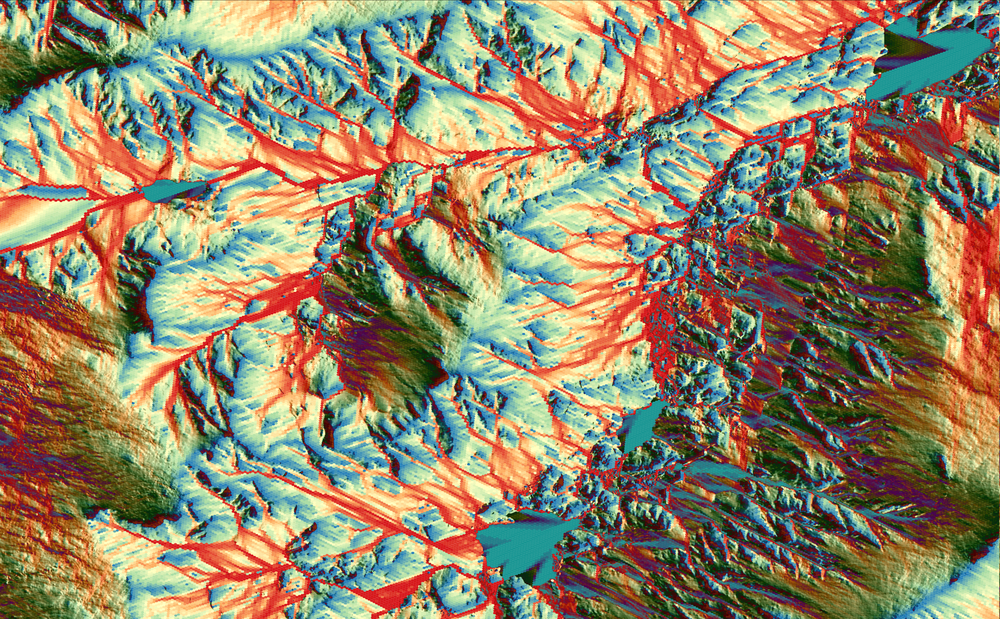

# HydroHex


**Put a hex on your watershed.**

A Python toolbox for **DGGS-native terrain preprocessing, flow routing and hydrologic analysis**, currently implemented for H3.

The package includes:

- D6 steepest-neighbor flow direction.
- A first facet-based D-infinity (D∞) adaptation for polygonal DGGS cells.
- Weighted flow graphs shared by D6 and D∞.
- Flow accumulation as equivalent contributing cells and physical area.
- Feature-preserving bilateral, mean and median smoothing.
- Pit/flat diagnostics.
- Graph-native Priority-Flood depression filling.
- First-pass least-cost depression breaching.
- Hybrid breach/fill conditioning.
- Deterministic analytic DEM generators plus raster-to-H3 ingestion.
- Direct Parquet/GeoParquet and partitioned `raster2dggs` dataset ingestion.
- USGS 3DEP fetch + real-terrain regression workflow.
- QGIS-ready GeoPackage export, including cell polygons, cell centres, flow vectors and accumulation fields.
- A unified `hydrohex` CLI and an end-to-end self-test.
- Shared-memory worker threads for independent cell-local operations.

The routing/conditioning algorithms use **DGGS cell IDs and topology as the authoritative data model**. Polygon, point and line geometries are derived for visualization and GIS interoperability.

## Install with Conda

```bash
conda env create -f environment.yml
conda activate hydrohex
```

To refresh an existing environment:

```bash
conda env update -f environment.yml --prune
conda activate hydrohex
```

Or install into an existing Python environment:

```bash
python -m pip install -e '.[all]'
```

Verify the toolbox:

```bash
pytest
hydrohex self-test --workers 2
```

## CLI overview

```text
hydrohex generate       Generate deterministic analytic H3 DEM test suites
hydrohex fetch-dem      Download a clipped USGS 3DEP GeoTIFF
hydrohex import-raster  Sample a raster DEM onto H3 cell centres
hydrohex real-dem-test  Fetch + ingest + route + accumulate a real Loch Vale DEM
hydrohex preprocess     Smooth and/or hydrologically condition an H3 DEM
hydrohex route          D6/D∞ routing + accumulation without preprocessing
hydrohex pipeline       Preprocess + route + accumulate + export
hydrohex self-test      Exercise the local toolbox on a small H3 DEM
```

Use `hydrohex <command> --help` for all options.

### Direct `raster2dggs` → HydroHex workflow

HydroHex can read `raster2dggs` output directly; no GeoPackage conversion is required. `raster2dggs` writes Hive-partitioned Apache Parquet datasets, and HydroHex automatically selects the finest `h3_XX` cell-ID column and the scalar `band_1` elevation column when present. Geometry and lower-resolution parent partition columns are ignored.

For a DEM such as `Taranaki.tiff`:

```powershell
raster2dggs h3 Taranaki.tiff Taranaki_h3 --resolution 13 --sample bilinear --band 1 --nodata omit --decimals none --cell-id string --geo polygon --compression zstd --processes 8
```

Then route and accumulate the partitioned Parquet directory directly:

```powershell
hydrohex pipeline Taranaki_h3 Taranaki_flow.gpkg --method both --condition fill --workers 8
```

A single `.parquet`, `.pq`, or `.geoparquet` file is also accepted. If a Parquet dataset contains multiple numeric value bands, select the DEM explicitly with `--elevation-field`; similarly, `--id-field` overrides H3-ID autodetection. `raster2dggs --cell-id uint64` is supported and is converted back to canonical H3 hexadecimal strings on ingest. For flow routing, avoid `--compact` because HydroHex expects one uniform H3 resolution.

### Generate the default QGIS benchmark

```bash
hydrohex generate --format gpkg --output-dir data/generated --workers 4
```

Defaults are H3 **resolution 12**, footprint-equivalent radius **220**, and four deterministic analytic surfaces (`plane`, `bowl`, `ridge`, `cone`). These remain the fast correctness tests. Realism testing now uses USGS 3DEP instead of neutral random landscapes.

Generate a smaller analytic suite:

```bash
hydrohex generate \
  --format gpkg \
  --resolution 10 \
  --radius 12 \
  --workers 4
```

### Real USGS 3DEP benchmark

The preferred realism test is now **Loch Vale watershed in Rocky Mountain National Park, Colorado**. USGS describes the basin as an alpine/subalpine watershed of about 660 ha (6.6 km²), with strong relief and two principal tributaries (Andrews Creek and Icy Brook), making it a cleaner hydrologic benchmark than an urbanized foothills site.

The toolbox requests **1 m** output from the USGS 3DEP dynamic ImageServer and ingests it to **H3 resolution 13**. USGS identifies the 1-meter seamless dataset as its highest-resolution seamless national elevation product. The dynamic service mosaics the best available source data, so a 1 m request is a requested sampling interval rather than a guarantee that every source pixel is natively 1 m.

Run the complete benchmark in one command:

```bash
hydrohex real-dem-test --site loch-vale --work-dir data/real_dem/loch_vale --resolution 13 --pixel-size-m 1 --sampling bilinear --condition fill --workers 8
```

This writes the downloaded GeoTIFF, an H3 DEM CSV/GeoPackage, a routed/accumulated GeoPackage, and `real_dem_summary.json`. Large USGS exports are automatically split into smaller 1024×1024 requests and mosaicked locally because the ArcGIS service can return HTTP 500 for large float32 TIFF exports even when the overall width/height are within the published 8000×8000 limit. Use `--tile-size 512` if a network/service run is still unstable. The built-in Loch Vale AOI is `(-105.688, 40.266, -105.645, 40.301)` and is about 3648×3892 pixels at the 1 m request. At H3 resolution 13 the rectangular AOI is expected to contain on the order of 300,000 cells, so this is intentionally a substantially heavier benchmark than the analytic tests.

The two stages can also be run separately:

```bash
hydrohex fetch-dem data/real_dem/loch_vale/usgs_3dep_loch_vale_1m.tif --site loch-vale --pixel-size-m 1
hydrohex import-raster data/real_dem/loch_vale/usgs_3dep_loch_vale_1m.tif data/real_dem/loch_vale/loch_vale_h3.gpkg --resolution 13 --sampling bilinear
```

Raster ingestion samples the source DEM at H3 cell centres. `nearest` and `bilinear` sampling are supported. `--site boulder` remains available as an optional mixed urban/natural stress test, and `--bbox WEST SOUTH EAST NORTH` overrides either built-in site.

Example screenshot asset now included in the repository:




### Run only flow direction + accumulation

Input may be CSV, a GeoPackage `cells` layer, a single Parquet/GeoParquet file, or a partitioned Parquet dataset directory such as `raster2dggs` output.

```bash
hydrohex route input.gpkg routed.gpkg --method both --workers 8
```

Choose one method if desired:

```bash
hydrohex route input.csv d6.gpkg --method d6 --workers 8
hydrohex route input.csv dinf.gpkg --method dinf --workers 8
```

### Feature-preserving smoothing + hybrid conditioning + routing

```bash
hydrohex pipeline input.gpkg conditioned_flow.gpkg \
  --smooth bilateral \
  --smooth-iterations 2 \
  --spatial-sigma-m 30 \
  --elevation-sigma-m 2.5 \
  --condition hybrid \
  --max-fill-depth-m 1.0 \
  --max-breach-depth-m 8.0 \
  --min-slope 0.00001 \
  --method both \
  --workers 8
```

The output preserves diagnostics such as:

```text
elevation_raw_m
elevation_m
elevation_delta_m
terrain_modified
smooth_delta_m
fill_depth_m
breach_depth_m
```

alongside D6/D∞ direction and accumulation fields.

### Preprocess without routing

```bash
hydrohex preprocess raw.gpkg conditioned.gpkg \
  --smooth bilateral \
  --condition fill \
  --workers 8
```

CSV output is also supported for preprocessing:

```bash
hydrohex preprocess raw.csv conditioned.csv --condition fill
```

## Terrain preprocessing

### Smoothing

`mean` and `median` are useful reference filters. `bilateral` is the preferred first feature-preserving filter. For source cell `i` and neighbor `j` it combines spatial distance and elevation similarity:

```text
w_ij = exp(-d_ij² / (2 sigma_space²))
       * exp(-(z_i-z_j)² / (2 sigma_elevation²))
```

Large elevation jumps therefore receive low weight, helping preserve ridges, banks and incised features.

### Priority-Flood filling

The filler uses domain-boundary H3 cells as outlets and traverses the DGGS adjacency graph with a priority queue. It can optionally impose a minimum downslope gradient to avoid completely flat filled surfaces.

### Breaching

The current breacher is a first graph-native implementation. For each strict pit it searches for a low-excavation path toward lower terrain or a domain boundary and carves a monotonically descending profile. `--max-breach-depth-m` can reject overly destructive paths.

### Hybrid conditioning

Hybrid mode estimates Priority-Flood fill depths, attempts breaching for pits deeper than `--max-fill-depth-m`, then performs a final Priority-Flood pass to resolve remaining depressions.

See [docs/PREPROCESSING.md](docs/PREPROCESSING.md) for algorithm notes and limitations.

## Flow direction

### D6

For each cell, D6 examines the immediate H3 neighbors and selects the largest positive center-to-center slope:

```text
slope = (z_source - z_neighbor) / center_distance
```

Normal H3 hexagons have six neighbors; pentagons naturally have five.

### D∞

For each source cell:

1. Get immediate DGGS neighbors.
2. Convert their centres to a local east/north tangent plane.
3. Sort neighbors cyclically by geometric angle.
4. Form triangular facets from consecutive neighbor pairs and the source.
5. Fit a plane to each facet.
6. Find the facet's continuous steepest-downslope direction.
7. Route to one or two bounding neighbors, with fractions summing to one.
8. Select the globally steepest valid candidate.

The implementation uses actual local neighbour geometry rather than assuming a regular 60-degree hexagon.

## Weighted graph + flow accumulation

D6 and D∞ become the same downstream structure:

```text
D6:   A --1.0--> B

D∞:   A --0.72--> B
       A --0.28--> C
```

The shared accumulator computes:

```text
accum_cells      equivalent contributing-cell count
accum_area_m2    physical contributing area from actual H3 cell areas
edge_contam      conservative boundary-contamination flag
```

Accumulation uses a Kahn-style topological-front traversal in `O(V + E)` and raises `FlowCycleError` if supplied a cyclic flow graph. Wide dependency-ready fronts can be processed with worker threads; each worker produces thread-local downstream contributions that are reduced before the next front begins, so D∞ receiver fractions remain conservative without concurrent writes.

## QGIS layers

A routed GeoPackage may contain:

```text
cells             H3 polygons + D6 + accumulation + preprocessing fields
cell_centres      one point per H3 cell; ideal for vector-field symbols
flow_direction    D6 centre-to-centre lines
sinks             D6 sink points

dinf_cells        H3 polygons + D∞ receivers/fractions + accumulation
dinf_direction    continuous D∞ display vectors
dinf_receivers    source-to-receiver lines with flow fractions
dinf_sinks        D∞ sink points
```

For vector-field rendering in QGIS, use `cell_centres` and data-defined marker rotation:

```text
d6_dir_deg_n_cw       D6: 0=north, clockwise
dinf_dir_deg_n_cw     D∞: 0=north, clockwise
```

A useful accumulation visualization is:

```text
log10("dinf_accum_area_m2")
```

for marker size or graduated color.

## Synthetic test surfaces

Analytic surfaces:

- `plane` — predictable uniform descent.
- `bowl` — closed convergence/sink case.
- `ridge` — divergence away from a ridge.
- `cone` — radial divergence.

The analytic surfaces are retained for strict algorithmic correctness. The default realism benchmark is now a real USGS 3DEP raster ingested onto H3 cell centres, so drainage structure is evaluated on observed topography rather than a stochastic neutral landscape.

The older neutral-surface generator remains available as an optional Python utility for experiments, but it is no longer part of default benchmark generation or the main test suite.

## Parallel execution

`--workers N` currently applies to:

- D6 direction.
- D∞ direction.
- Mean/median/bilateral smoothing within each iteration.
- Flow accumulation on sufficiently wide topological fronts.

Routing and smoothing use shared-memory threads for independent cell-local work. Accumulation uses a front/reduce strategy: all cells in the current dependency-ready front are read-only, workers build thread-local receiver contributions, and the main thread reduces those updates before advancing to the next front. This avoids locks/atomics on downstream accumulation values and works for both D6 and weighted D∞ graphs.

Accumulation automatically stays serial for narrow fronts (default threshold: 256 cells), where thread scheduling would cost more than it saves. `AccumulationResult.stats` reports the number of fronts, maximum front width, and how many fronts actually used workers.

These operations intentionally remain serial today because their traversal/order is inherently stateful in the current reference implementation:

- Priority-Flood filling.
- Sequential pit breaching.

The threaded accumulator is an intermediate implementation. Pure-Python arithmetic is still constrained by interpreter overhead, so the larger performance step remains an indexed NumPy topology representation and compiled/vectorized kernels; the public `workers` interface is designed to survive that transition.

## Python API example

```python
from hydrohex.pipeline import run_h3_pipeline
from hydrohex.qgis import export_flow_geopackage

# elevation = {h3_cell_id: elevation_m, ...}
result = run_h3_pipeline(
    elevation,
    methods=("d6", "dinf"),
    smooth="bilateral",
    condition="hybrid",
    workers=8,
)

export_flow_geopackage(
    result.elevation,
    result.d6,
    "output.gpkg",
    dinf_results=result.dinf,
    d6_accumulation=result.d6_accumulation,
    dinf_accumulation=result.dinf_accumulation,
    extra_cell_fields=result.extra_cell_fields,
)
```

The lower-level DGGS-independent functions remain available for non-H3 adapters.

## Repository layout

```text
src/hydrohex/
  cli.py              unified command-line interface
  pipeline.py         H3 preprocessing/routing/accumulation orchestration
  parallel.py         shared independent-cell worker interface
  core.py             DGGS-independent D6 kernel
  dinf.py             DGGS-independent D∞ facet kernel
  graph.py            weighted flow graph
  accumulation.py     topological flow accumulation
  h3_grid.py          H3 topology/distance/local-XY adapter
  raster.py           raster sampling and raster-to-H3 ingestion
  usgs.py             clipped USGS 3DEP downloader
  real_dem.py         real-terrain benchmark orchestration
  neutral.py          optional neutral landscape utility
  datasets.py         deterministic analytic DEM generators
  qgis.py             GeoPackage layers
  qgis_datasets.py    benchmark suite generator
  terrain/
    smooth.py
    depressions.py
    fill.py
    breach.py
    condition.py

tests/                 unit, integration, parallel, CLI and toolbox tests
docs/                  CLI and preprocessing notes
```

## Tests and CI

```bash
pytest
make self-test
```

The tests cover D6, D∞, weighted graphs, accumulation, raster sampling, USGS request construction, preprocessing, serial-vs-parallel equivalence, QGIS helpers and the CLI. When H3 is installed, `test_toolbox_e2e.py` runs the full deterministic preprocessing → D6/D∞ → accumulation path. The opt-in `tests/test_real_dem.py` downloads a small live USGS 3DEP clip and runs the complete raster → H3 → routing → accumulation workflow. `hydrohex self-test` additionally verifies a GeoPackage write when GIS dependencies are available.

## Current limitations

- D∞ is a first DGGS adaptation of the triangular-facet concept, not a mathematical claim that H3 is equivalent to a square raster.
- D∞ two-receiver routing currently requires both bounding receivers to be lower than the source.
- D∞ uses a local tangent-plane approximation around each source cell.
- Breaching is an initial least-cost implementation and should be validated against established terrain-conditioning packages before scientific production use.
- Flat-resolution beyond optional minimum-slope enforcement is not yet a dedicated algorithm.
- Threaded cell-local kernels are an interim performance layer; the indexed NumPy/compiled representation remains the main optimization target.

## Legacy entry points

The earlier commands are retained for compatibility:

```bash
hydrohex-generate-dems
hydrohex-generate-qgis
python -m hydrohex.datasets
python -m hydrohex.qgis_datasets
```

## License

MIT

### USGS download note

The `fetch-dem` and `real-dem-test` commands automatically tile large ArcGIS ImageServer requests (1024 pixels per tile by default), retry transient HTTP 429/5xx failures, and mosaic the tiles onto one exact global raster grid. Each returned tile is reprojected from its actual GeoTIFF transform rather than pasted by array position, and ArcGIS square-pixel extent adjustment is disabled; this prevents artificial elevation steps at tile boundaries. This avoids the HTTP 500 failures seen on large 1 m float32 exports and also uses Windows-safe final-file handling. The adjacent `.tif.json` sidecar is written only after TIFF validation and records whether the download used direct or tiled delivery. If you have an older prototype Loch Vale raster with tile seams, regenerate it with `--overwrite`.
